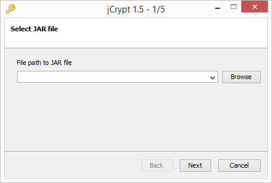

# jCrypt
Includes wizard for building your file (Check releases, jCrypt.jar). Bin.jar has to be in the working directory of jCrypt.jar

Encrypts your input archive and writes it to a copy of Bin.jar, and sets encryption key, initialization vector, encrypt resources and mainclass in the extra field.
When ran, it will load the information in the extra field, decrypt and load the entry containing your encrypted JAR and invoke it.

## Format

Encrypt(K,I): Encrypt using symmetric key

P: Target JAR
K: Symmetric key
I: IV for K
C: Resource encryption boolean

Store P as Encrypt(K, I) in jar.dat
Store K || I || C as extra header in P
